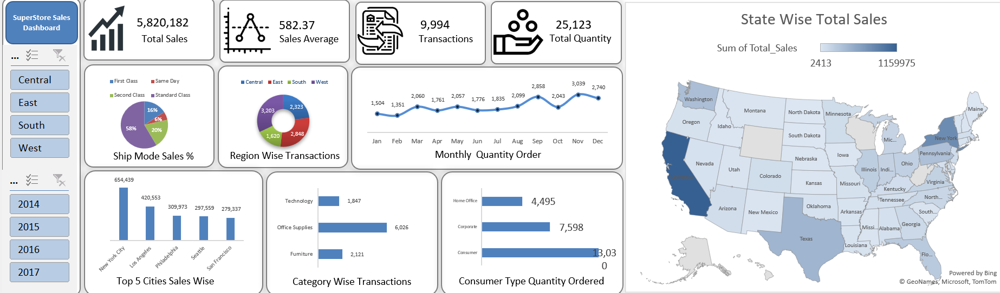

# SuperStore Sales Dashboard (Excel)

An interactive sales dashboard built entirely in **Microsoft Excel** using Power Query-style data cleaning, PivotTables, PivotCharts, a map chart and slicers. It turns a messy US retail sales extract (~11K rows) into a clean dataset and a one-page dashboard covering sales, quantity, shipping, geography, categories and customer segments.



---

## Table of Contents
- [Project Overview](#project-overview)
- [Key Metrics](#key-metrics)
- [Dashboard Features](#dashboard-features)
- [Data Cleaning](#data-cleaning)
- [Workbook Structure](#workbook-structure)
- [Key Insights](#key-insights)
- [Known Limitations](#known-limitations)
- [Tools and Skills Demonstrated](#tools-and-skills-demonstrated)
- [How to Use](#how-to-use)
- [Repository Structure](#repository-structure)

---

## Project Overview

| | |
|---|---|
| **Goal** | Clean raw retail sales data and build an interactive executive dashboard |
| **Tool** | Microsoft Excel (PivotTables, PivotCharts, Map chart, Slicers) |
| **Data** | US retail (Superstore-style) orders, 2014 to 2017 |
| **Raw size** | 10,993 rows x 20 columns |
| **Clean size** | 9,994 rows x 20 columns |
| **Scope** | 49 states, 4 regions, 3 categories, 17 sub-categories, 3 customer segments |

## Key Metrics

| KPI | Value |
|---|---|
| Total Sales | 5,820,182 |
| Average Sales per Order Line | 582.37 |
| Order Lines | 9,994 (across 5,009 unique orders) |
| Total Quantity | 25,123 |

## Dashboard Features

- **4 KPI cards:** Total Sales, Sales Average, Transactions, Total Quantity
- **Ship Mode Sales %** (pie chart)
- **Region-wise Transactions** (doughnut chart)
- **Monthly Quantity Ordered** (line chart)
- **Top 5 Cities by Sales** (column chart)
- **Category-wise Transactions** (bar chart)
- **Consumer Type Quantity Ordered** (bar chart)
- **State-wise Total Sales** (filled map chart)
- **Slicers** for **Region** and **Year**, which filter the dashboard interactively

## Data Cleaning

The raw sheet (`Row Data`) had several quality problems. The cleaned version is in `Cleaned Data`.

| Issue in raw data | Fix |
|---|---|
| 999 duplicate Row IDs (71 exact duplicate rows) | Removed duplicates, leaving 9,994 unique rows |
| Region typos: `Wezt`, `Sauth` | Corrected to `West`, `South` |
| Category typo: `Furnture` | Corrected to `Furniture` |
| Inconsistent Segment casing (`CONSUMER`, `consumer`, `home office`...) | Standardised to `Consumer`, `Corporate`, `Home Office` |
| ~3,300 missing Category values | Restored using the Product ID prefix (`FUR`, `OFF`, `TEC`) |
| ~3,300 missing State values | Filled by matching Postal Code to State |
| ~4,000 missing Customer Names | Filled by matching Customer ID |
| Quantity contained `unknown` and `---` | Cleaned and filled (method: _add your method here_) |
| Price/Unit contained blanks and text | Cleaned and filled (method: _add your method here_) |
| `Sales` column completely empty | Calculated as `Price_Per_Unit x Quantity` (`Total_Sales`) |
| Mixed date formats (text and true dates) | Converted to a proper date type |
| Column names with spaces and symbols | Renamed (e.g. `Price/Unit` to `Price_Per_Unit`) |

**Validation checks after cleaning:** unique Row IDs, no missing values, every Product ID prefix matches its Category, every Postal Code maps to one State, every State maps to one Region, and `Total_Sales = Price_Per_Unit x Quantity` on all rows.

## Workbook Structure

| Sheet | Purpose |
|---|---|
| `Dashboard` | Final one-page dashboard with charts, map and slicers |
| `pivot Report` | 11 PivotTables that feed every chart and KPI card |
| `Cleaned Data` | Analysis-ready dataset (9,994 rows) |
| `Row Data` | Original untouched data (10,993 rows) |

## Key Insights

- **Growth:** sales were flat from 2014 to 2015 (about 1.20M each year), then grew about 31% in 2016 and about 19% in 2017 (1.86M).
- **Geography is concentrated:** California (19.9%) and New York (13.5%) together account for about a third of total sales. New York City is the top city at 654K.
- **Top 5 cities** (New York City, Los Angeles, Philadelphia, Seattle, San Francisco) generate about 34% of sales.
- **Regions:** West has the most order lines (3,203), followed by East (2,848), Central (2,323) and South (1,620).
- **Shipping:** Standard Class drives 58.5% of sales, Second Class 20%, First Class 16% and Same Day about 6%.
- **Categories:** Office Supplies makes up 60% of order lines, Furniture 21% and Technology 18%.
- **Segments:** Consumers order 52% of total quantity, Corporate 30% and Home Office 18%.
- **Seasonality:** quantity peaks in September and November and is lowest in January and February.

## Known Limitations

Being upfront about these so the numbers are read correctly:

- **Date fields:** the raw data mixed day/month and month/day formats, so some Order Dates and Ship Dates are inconsistent (some ship dates fall before order dates). Year-level results are reliable, but the **monthly chart should be treated as indicative only**.
- **"Transactions" means order lines**, not unique orders. There are 9,994 order lines across 5,009 unique orders.
- **Skewed sales:** the average (582) is much higher than the median (124), because a small number of very large orders make up a big share of sales (the top 1% of lines is about 22% of total).
- **No profit data:** the dataset has no cost or profit column, so margin analysis is not possible in this version.
- **Filled values:** a portion of Quantity and Price/Unit values were imputed during cleaning (see the Data Cleaning table).

## Tools and Skills Demonstrated

- Data cleaning and validation (deduplication, standardisation, imputation, integrity checks)
- PivotTables and PivotCharts
- Excel Map chart (geographic analysis)
- Slicers for interactive filtering
- KPI card and dashboard layout design
- Business insight writing

## How to Use

1. Download `Excel_Final_Dashboard_Project1.xlsx`.
2. Open it in **Microsoft Excel** (desktop version recommended, as the map chart and slicers need it).
3. Go to the `Dashboard` sheet and use the **Region** and **Year** slicers to explore.
4. To refresh after changing the data, go to **Data > Refresh All**.

## Repository Structure

```
├── Excel_Final_Dashboard_Project1.xlsx   # Full workbook (dashboard, pivots, cleaned + raw data)
├── Sales_Dashboard.png                   # Dashboard screenshot (shown at the top of this README)
├── README.md
├── images/                               # Individual chart screenshots
│   ├── Average.png
│   ├── Quantity.png
│   ├── Sales.png
│   └── Transactions.png
├── data/
│   └── Warehouse_and_Retail_Sales.xlsx   # Global retail dataset (reference data)
└── docs/
    └── 12302841 excel report.docx        # Project report
```

## Author

**Deepak Chaudhary**
B.Tech Computer Science (Data Science)

_Feel free to open an issue or reach out with feedback._
